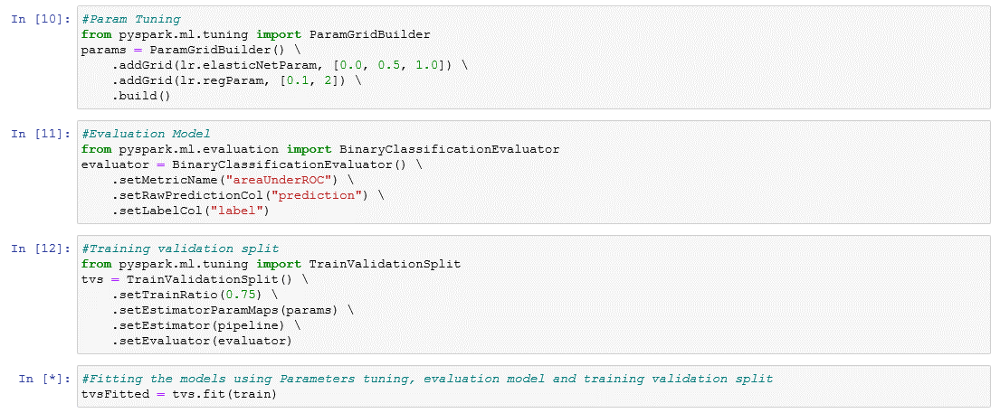
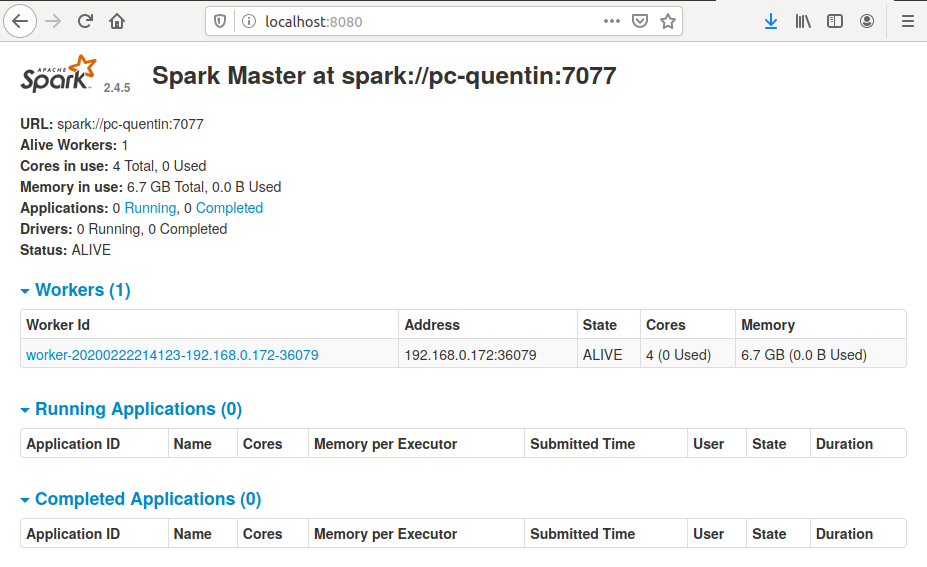

# Tutoriel d'une technologie émergente : Spark


Ce tutoriel a pour objectif de faire découvrir la technologie [Spark](https://spark.apache.org/).\
Il s'inscrit dans le cadre du cours [8INF853 - Architecture des applications d'entreprise](https://cours.uqac.ca/8INF853) dispensé par Fabio Petrillo pour le programme de [Maîtrise en informatique](https://www.uqac.ca/programme/3037-maitrise-en-informatique/) à l'UQAC.  

<!-- START doctoc generated TOC please keep comment here to allow auto update -->
<!-- DON'T EDIT THIS SECTION, INSTEAD RE-RUN doctoc TO UPDATE -->
**Sommaire**

- [Présentation de Spark](#pr%C3%A9sentation-de-spark)
  - [Contexte](#contexte)
  - [Historique](#historique)
  - [Philosophie](#philosophie)
    - [Plateforme unifié](#plateforme-unifi%C3%A9)
    - [Moteur de calcul](#moteur-de-calcul)
    - [Librairies](#librairies)
  - [Architecture](#architecture)
- [Tutoriel](#tutoriel)
  - [Installation de Spark](#installation-de-spark)
  - [Utilsation de Spark](#utilsation-de-spark)
    - [Exemple 1 : Wordcount](#exemple-1--wordcount)
    - [Exemples 2 : Clustering](#exemples-2--clustering)
    - [Exemple 3 : Classification](#exemple-3--classification)
  - [Lancement d'un cluster Spark en utilisant le mode autonome ("standalone")](#lancement-dun-cluster-spark-en-utilisant-le-mode-autonome-standalone)
- [Auteurs](#auteurs)
- [Références](#r%C3%A9f%C3%A9rences)

<!-- END doctoc generated TOC please keep comment here to allow auto update -->

## Présentation de Spark

Apache Spark est un **framework open source** de **calcul distribué**.\
Développé à l’université de Californie à Berkeley en 2014, Spark est aujourd’hui un projet de la fondation Apache.\
Il s'agit essentiellement d'un cadre applicatif de traitements **big data** pour effectuer des analyses complexes à grande échelle.\
Spark permet d’optimiser l’utilisation d’un **cluster** pour des opérations d'analyses et permet ainsi de minimiser le temps requis pour obtenir les résultats.\
Ce framework fournit plusieurs composants et librairies aux utilisateurs pour le traitement de données :


### Contexte

Pourquoi avons-nous besoin d’un nouveau **moteur de calcul** et d’un **modèle de programmation distribué** pour l’analyse de données ?\
Comme plusieurs autres changements dans le monde celui-ci provient en partie de **raisons économiques** liées aux applications ainsi qu’au matériel informatique.

Historiquement les processeurs des ordinateurs devenaient de plus en plus rapides d’année en année. Ainsi par défaut les applications construites sur ceux-ci devenaient également plus rapides. Ceci a mené a l’établissement d’un large écosystème d’applications conçues pour être exécutées principalement sur un seul processeur.

Cette tendance prit malheureusement fin vers 2005 en raison des limitations au niveau de la dissipation de chaleur liée à l’augmentation de cadence des processeurs. À partir de ce moment, les manufacturiers ont plutôt choisi d’ajouter plusieurs cœurs au processeur. Ceci a pour effets de modifier les patrons de création d’application pour utiliser un modèle à plusieurs processus.

Durant ce même laps de temps, les technologies do stockage et d'acquisition de données n’ont pas subi la même pression que les processeurs. De ce fait, le coût de stockage et des technologies d’acquisition de données ont considérablement diminué (camera, capteur, IOT, etc.). Ceci a donc causé une explosion de la quantité de données disponibles prêtes à être analyser.

Cette quantité astronomique de données à analyser a donc générer un nouveau besoin : celui d'une grande **plateforme de calculs distribués** telle que Spark.

### Historique

- 2009 : Conception de Spark par [Matei Zaharia](https://en.wikipedia.org/wiki/Matei_Zaharia) lors de son doctorat a l’université de Californie à Berkeley. À l’origine la solution a pour but d’accélérer le traitement des systèmes Hadoop.
- 2013 : Transmission de Spark a la [fondation Apache](https://www.apache.org/). Il devient alors l’un des projets les plus actifs de la fondation.
- 2014 : Spark remporte le Daytona GraySort Contest (trier 100 To de donnés le plus rapidement possible). Le record, détenu préalablement par Hadoop (72 minutes), est largement battu avec un temps d'exécution de seulement 23 minutes. Spark démontre ainsi sa puissance en étant 3 fois plus rapide et en utilisant approximativement 10 fois moins de machines qu'Hadoop (206 contre 2100).

### Philosophie

La philosophie de base de Apache Spark est de fournir un moteur de calcul unifié et une collection de librairies pour le **big data**.

#### Plateforme unifié

Le but est de fournir une plateforme pour la création d’application big data. Spark est désigné pour supporter une grande variété de tâches liées à l’analyse de données que ce soit l'**importation de données et des requêtes SQL** mais également des **tâches d’apprentissage automatique** et des calculs sur des flux (**streaming**). Toutes ces tâches sont réalisées à partir du même moteur de calcul avec un ensemble d’API consistants. Ces **API consistants** ont également comme fonction l’optimisation des calculs. Ainsi, si vous faites une importation de données via une requête SQL et ensuite vous demandez l’exécution d’un calcul d’apprentissage automatique sur le même jeu de données. Le moteur de Spark va combiner les 2 opérations et tenter d’optimiser le plus possible les étapes pour fournir l’exécution la plus performante possible.\
Spark est créé en [Scala](https://www.scala-lang.org/), il supporte également Java, Python, SQL et R. Certaines distinctions existent en fonction des langages utilisés, mais l’essentiel est disponible pour ceux-ci. Puisque Spark fut créé en Scala, ce dernier est le langage de programmation le plus puissant pour l'utilisation de Spark puisqu’il permet d’atteindre les API de bas niveau plus efficacement.

#### Moteur de calcul

Tout en tentant de rester unifié, Spark limite le plus possible l’étendue de son moteur de calcul. Dans ce sens, il prend en change l’importation des données et le calcul en mémoire mais ne prend par contre pas en charge le stockage permanent des données après les calculs. Cependant, Spark reste compatible avec une grande variété de produits de stockage tels que : 
- Systèmes de stockage sur le Cloud : [Azure Storage](https://azure.microsoft.com/en-us/services/storage/) et [Amazon S3](https://aws.amazon.com/fr/s3/)
- Systèmes de fichiers distribués : [Apache Hadoop](https://hadoop.apache.org/)
- Bases de données NoSQL clé-valeur : [Apache Cassandra](http://cassandra.apache.org/)
- Agents de messages : [Apache Kafka](https://kafka.apache.org/)

Spark ne fait que les utiliser, il ne stocke rien pour ses calculs et ne préfère aucune solution en particulier. L’idée derrière ceci est que les données utilisées pour les calculs existent déjà à travers une multitude de solutions de stockage. Le déplacement de données est un mécanisme coûteux, c'est pourquoi Spark se concentre sur l'exécution des calculs sur les données et ceci peu importe leurs emplacements. Ce point est en fait ce qui le distingue des plateformes précédentes telles qu’Apache Hadoop. Cette plateforme offrait le stockage (**Hadoop File System**), le moteur de calcul (**MapReduce**) et le service de cluster. Ceci bloquait ainsi le traitement de données stockées sur d'autres solutions de stockage.

#### Librairies

Le dernier composant est les **librairies** qui ont été crées de façon unifiée pour tirer profit du moteur de calcul. Spark supporte les librairies livrées avec le produit ainsi que celles crées par la communauté. Les librairies sont l’un des aspects les plus importants du projet et fournissent de plus en plus de fonctionnalités à Spark. Actuellement, les librairies offrent les fonctionnalités de : 
- Requête sur des données structurées ([Spark SQL](https://spark.apache.org/sql/))
- Apprentissage automatique ([Spark MLib](https://spark.apache.org/mllib/))
- Traitement en continu de flux de données ([Spark Streaming](https://spark.apache.org/streaming/))
- Analyse de graphe ([Spark Graph X](https://spark.apache.org/graphx/))
- Des centaines d’autres connecteurs et librairies...

### Architecture

L’architecture de Spark est bien sûr de type distribué, il contrôle et coordonne l'exécution de tâches sur un [cluster de machines](https://fr.wikipedia.org/wiki/Grappe_de_serveurs). Un cluster Spark est composé de : 
- un noeud **driver** qui est chargé d'analyser,distribuer et programmer les tâches sur les différents **exécuteurs**. Il exécute la fonction **main()** du programme et constitue ainsi la pièce centrale de l'application.
- un ou plusieurs noeuds **workers** avec chacun un **exécuteur** qui est chargé d'exécuter les tâches confiées par le driver et retourner l'état du calcul au **driver**
- un **cluster manager** qui est chargé d'instancier les **workers** 


Une application Spark peut utilisée différents types de **cluster managers** :
- [Mode autonome de Spark](https://spark.apache.org/docs/latest/spark-standalone.html) ("standalone")
- [Apache Mesos](https://spark.apache.org/docs/latest/running-on-mesos.html)
- [Apache Hadoop YARN](https://spark.apache.org/docs/latest/running-on-yarn.html)
- Mode local : il n'y a pas de cluster manager dans ce mode, le nombre d'**exécuteurs** peut être spécifié ou bien déduit en fonction du nombre de coeurs de la machine.

Il est également disponible en modèle SaaS via [Azure](https://docs.microsoft.com/en-us/azure/hdinsight/spark/apache-spark-overview) ou [AWS](https://aws.amazon.com/fr/emr/features/spark/). Ceux-ci utilisent **YARN** en tant que cluster manager et fournissent une panoplie d’autres utilitaires tels que les notebooks [Apache Zepelin](https://zeppelin.apache.org/). La principale différence entre les différents modèles est la maintenance et le déploiement du cluster.

Le  modèle de base est capable de supporter la scalabilité ainsi que l’échec de tâches. Si un noeud tombe en panne, Spark va automatiquement renvoyé les tâches sur les autres noeuds (workers) disponibles.

## Tutoriel

Ce tutoriel se divise en deux phases :\
Dans la première phase, nous démonterons comment installer Spark et quelques cas d'utilisations en local pour comprendre son fonctionnement.\
Dans un deuxième temps, nous montrerons comment utiliser le mode de déploiement autonome de Spark pour lancer un cluster de machines.

### Installation de Spark

Spark fonctionne sur les systèmes Windows et UNIX (Linux, Mac OS). L'ensemble des commandes présentés pour l'installation se feront sur une machine sous Ubuntu 18.04. 

- S'assurer que la version 8 de Java est installé et que la variable JAVA_HOME est correctement configuré.
Les commandes suivantes permettent cette vérification :
```sh
$ java -version
openjdk version "1.8.0_242"
OpenJDK Runtime Environment (build 1.8.0_242-8u242-b08-0ubuntu3~18.04-b08)
OpenJDK 64-Bit Server VM (build 25.242-b08, mixed mode)

$ echo $JAVA_HOME
/usr/lib/jvm/java-8-openjdk-amd64
```
Remarque: Notez que l'affichage peut être différent en fonction du JDK installé mais il est important d'avoir la version 8.\
Dans le cas où Java n'est pas installé et/ou la variable d'environnement n'est pas configuré, vous pouvez vous référer au tutoriel suivant : https://www3.ntu.edu.sg/home/ehchua/programming/howto/JDK_Howto.html

- S'assurer qu'une version 3.4+ de python est installée (pour utiliser pyspark)
```
$ python --version
Python 3.7.2
```
Dans le cas où python n'est pas installé, vous pouvez vous référer au tutoriel suivant : https://realpython.com/installing-python/

- Installer spark
    + Télécharger la version 2.4.5 de Spark préconfigurée pour Hadoop 2.7 via le terminal ou depuis le [site officiel de Spark](http://spark.apache.org/downloads.html).
    ```sh
    $ curl -O https://downloads.apache.org/spark/spark-2.4.5/spark-2.4.5-bin-hadoop2.7.tgz
    ```
    + Extraire le fichier et le placer dans un repertoire :
    ```sh
    $ tar xvf spark-2.4.5-bin-hadoop2.7.tgz
    $ mv spark-2.4.5-bin-hadoop2.7 /opt/spark/
    ```
    + Configurer les variables d'environnement :
        * Ouvrir le fichier de configuration du terminal
        ```sh
        $ vim ~/.bashrc
        ```
        * Ajouter la variable d'environnement SPARK_HOME et modifier la variable PATH dans ce fichier
        ```
        export SPARK_HOME=/opt/spark
        export PATH=$PATH:$SPARK_HOME/bin:$SPARK_HOME/sbin
        ```
        * Activer les changements
        ```sh
        $ source ~/.bashrc
        ```
Remarque : Sur Windows, il est en plus nécessaire de :
- Installer [winutils.exe](https://github.com/steveloughran/winutils)
- Récupérer winutils.exe correspondant à la version 2.7.1 de Hadoop
- Copier ce fichier dans **SPARK_HOME\hadoop\bin**
- Configurer la varaible d'environnement HADOOP_HOME = %SPARK_HOME%\hadoop

### Utilsation de Spark

Les 3 exemples suivants permettront de comprendre le fonctionnement de Spark et voir quelques unes des fonctionnalités offertes.

#### Exemple 1 : Wordcount

Ce premier exemple permet de vérifier que l'installation s'est bien déroulée et de prendre connaissance des notions fondamentales de Spark.
Il est directement fourni comme exemple dans l'arborescence de spark: **$SPARK_HOME/examples/src/main/python/wordcount.py** avec un ensemble d'autres exemples. Vous pouvez également retrouver une version un peu modifiée dans le dossier code de ce tutoriel.
```python
import sys
from operator import add
from pyspark.sql import SparkSession

if len(sys.argv) != 2:
    print("Usage: wordcount <file>", file=sys.stderr)
    sys.exit(-1)

# Récupération d'une SparkSession
spark = SparkSession\
    .builder\
    .appName("PythonWordCount")\
    .getOrCreate()

# Lecture d'un fichier texte : le fichier est décomposé en lignes
lines = spark.read.text(sys.argv[1]).rdd.map(lambda r: r[0])

# Décomposition de chaque ligne en mot (flatMap) pour associé à chaque mot une valeur (map)
# qui sera ensuite sommée avec les valeurs du même mot (reduceByKey).
word_counts = lines.flatMap(lambda line: line.split(' '))\
                   .map(lambda word: (word, 1))\
                   .reduceByKey(add)\
                   .collect()

# Chaque paire (clé, valeur) est affichée
for (word, count) in word_counts:
    print(word, count)
```
Voyons plus en détail les différents concepts Spark abordés dans ce code python:
- SparkSession est le point d'entrée pour exécuter des manipulations avec Spark. Le driver contrôle l'application grâce à SparkSession.
- **RDD ("Resilient Distributed Dataset)** est un structure de donnée fondamentale de Spark. Il s'agit d'une **collection d'éléments immuable et distribuée** des données, partionnée entre les différents noeud du cluster sur laquelle on peut appliquer des opérations de bas niveau telles que des transformations et des actions.
- les **transformations** (flatMap, map et reduceByKey) permettent de créer une nouvelle RDD depuis une existante. Celles-ci sont évaluées de manière **paresseuse** ("lazy evaluation"), c'est à dire uniquement en cas de besoin.
- les **actions** (collect) retournent une valeur après avoir effectuer un ensemble de calcul sur la RDD.
Les transformations sont seulement effectuées lorsqu'une action est effectuée ce qui permet à Spark d'optimiser les calculs. 

Pour tester ce code, nous allons utiliser wordcount_data.txt comme source de données.\
Pour exécuter le code, il suffit d'utiliser la commande suivante :
```sh
$ spark-submit code/wordcount.py data/wordcount_data.txt
```
Le résultat obtenu correspond aux mots associés au nombre de fois qu'ils ont été comptés.


Les exemple suivants utiliseront un notebook Jupyter. \
Ainsi, il est recommandé d'utiliser une environnement virtuel pour la suite du tutoriel. Pour cela, un outil intéressant est **virtualenv**, il permet de créer des environnements virtuels Python isolés en créant un dossier qui contient tous les exécutables nécessaires pour utiliser les paquets qu’un projet Python pourrait nécessiter.\
Pour installer **virtualenv** via pip :
```sh
$ pip install virtualenv
```
Une fois virtualenv installé, il suffit de créer et d'accéder à l'environnement virtuel :
```sh
$ virtualenv venv
$ source venv/bin/activate
```
Vous pouvez alors installer l'ensemble des librairies nécessaires pour la suite du tutoriel :
```sh
$ pip install jupyter
$ pip install numpy
$ pip install matplotlib
$ pip install pandas
$ pip install findspark
```
Plus tard, vous pourrez désactiver cet environnement virtuel :
```sh
$ deactivate
```
#### Exemples 2 : Clustering

Dans cet exemple, nous appliquerons un modèle de clustering (K-means) sur des données de log.
Cet exemple est un notebook Jupyter, il suffit donc d'exécuter la commande :
```sh
$ jupyter notebook code/Spark_Clustering_Kmeans.ipynb
```
Les différentes étapes sont les suivantes :
- Acquisition des données depuis un serveur SQL et création de la DataFrame :


- Ajout d’un identifiant unique et division de la Dataframe (échantillons d'entraînement et de test) :


- Création de la pipeline de transformation des données :


- Entraînement du modèle et agrégation des résultats :


- Jointure entre la table initiale et la table de résultat pour afficher tous les champs et affichage des différents clusters trouvés :


- Affichage des résultats :


#### Exemple 3 : Classification

Dans cet exemple, nous appliquerons un modèle de classification (Régression logistique) sur des données de log.
Cet exemple est un notebook Jupyter, il suffit donc d'exécuter la commande :
```sh
$ jupyter notebook code/Spark_Classification_Logistic_Regression.ipynb
```
Les différentes étapes sont les suivantes :
- Acquisition des données depuis un serveur SQL et création de la DataFrame :


- Requête SQL pour obtenir les données désirées :


- Création de la pipeline de transformation des données :


- Configuration des paramètres et entraînement du modèle :



- Evaluation du modèle et affichage des résultats :


### Lancement d'un cluster Spark en utilisant le mode autonome ("standalone")

On doit préalablement s'assurer que tous les noeuds du cluster ont [correctement installé Spark](#installation-de-spark).\
On peut ensuite lancer le noeud maître en exécutant la commande :
```sh
$ start-master.sh
```
On peut vérifié qu'il a bien été lancé en accédant à l'interface utilisateur de Spark disponible depuis l'URL : http://localhost:8080


On peut ensuite lancer les noeuds Worker en précisant l'URL du noeud maître qu'on peut observer depuis l'interface utilisateur de ce dernier :
```sh
$ start-slave.sh spark://<master_IP>:<port>
```
On peut voir qu'il a bien été ajouté via l'interface utilisateur du maitre : 



Sur Windows, les commandes pour lancer les noeuds maitre et Worker sont un peu différentes :
```sh
$ spark-class org.apache.spark.deploy.master.Master
$ spark-class org.apache.spark.deploy.worker.Worker spark://<master_IP>:<port>
```
Pour lancer une application sur le cluster, il suffit ensuite d'utiliser la commande suivante :
```sh
$ spark-submit --master spark://<master_IP>:<port> <application>
```
Vous pouvez par example essayer cette commande avec l'application Wordcount :
```sh
spark-submit --master spark://<master_IP>:<port> code/wordcount.py data/wordcount_data.txt 
```
Vous devriez observer une application complétée depuis l'interface utilisateur du maitre.


## Auteurs
Quentin LETORT - LETQ12039703\
Guillaume ROUTHIER - ROUG10088306

## Références
- [Wikipédia - Apache Spark](https://fr.wikipedia.org/wiki/Apache_Spark)
- [Spark : The Definitive Guide. Bill Chambers & Matei Zaharia. O’Reilly Media 2018.](https://www.oreilly.com/library/view/spark-the-definitive/9781491912201/)
- [Documentation officielle - Apache Spark](https://spark.apache.org/docs/latest/)
- [Open Classrooms - Réalisez des calculs distribués sur des données massives](https://openclassrooms.com/fr/courses/4297166-realisez-des-calculs-distribues-sur-des-donnees-massives/4308661-allez-au-dela-de-mapreduce-avec-spark)
